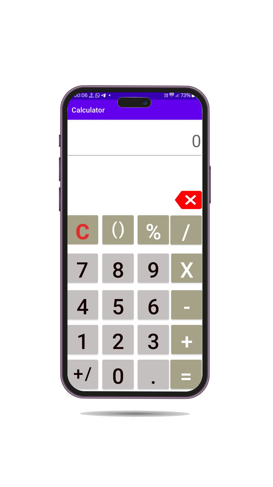
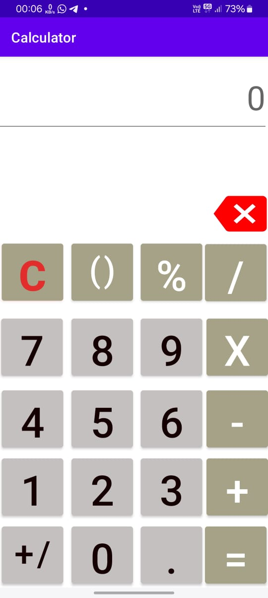
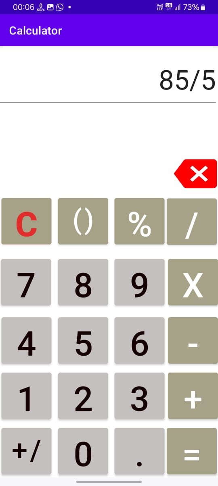

# Calculator App

## Description

This is a simple calculator app developed using Java in Android Studio. It performs basic arithmetic operations such as addition, subtraction, multiplication, and division.  It's designed to be user-friendly and efficient for everyday calculations.

## Features

*   Performs basic arithmetic operations (+, -, *, /).
*   Clear button to reset the display.
*   Handles decimal inputs.
*   Simple and intuitive user interface.
*   Responsive design for different screen sizes.

## Tech Stack

*   Java
*   Android Studio
*   XML (for layout)

## Setup Instructions

1.  Clone the repository: `git clone https://github.com/princesinghbits/Calculator-App.git`
2.  Open the project in Android Studio.
3.  Build the project.
4.  Run the app on an Android emulator or a physical Android device.

## Screenshots

[Calculator App Demo](screenshot/clcvid.mp4)

## Author Information

**Prince Singh**

*   GitHub: (https://github.com/princesinghbits) 
*   Email: (2021wa86263@wilp.bits-pilani.ac.in)
